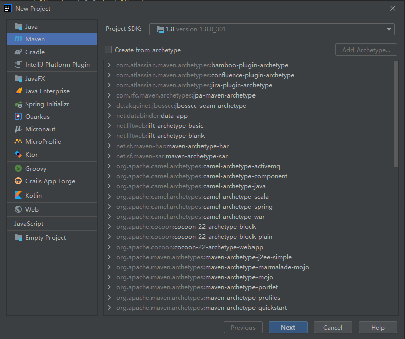
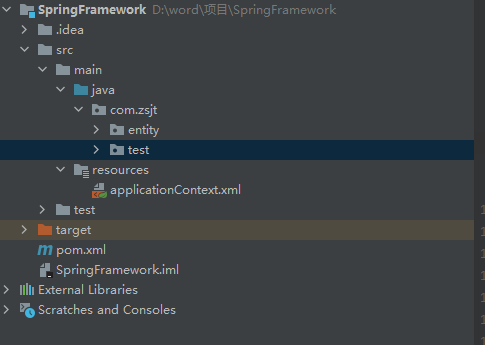

<div align='center' ><font size='70'>SpringFramework教学</font></div>

官网地址：https://spring.io/projects/spring-framework

简述：Spring Framework 为基于 Java 的现代企业应用程序提供了一个全面的编程和配置模型——在任何类型的部署平台上。
			Spring 的一个关键元素是应用程序级别的基础设施支持：Spring 专注于企业应用程序的“管道”，因此团队可以专注于应用程序级别的业务逻辑，而无需与特定部署环境建立不必要的联系。

# 一、核心内容

​	Spring Framework有两个核心技术点IOC和AOP

​	**IOC**(控制反转)：简单讲就会把对象提前创建好放在容器里，降低项目的耦合性可以对bean的创建和生命周期进行管理。

​	**AOP**(面向切面编程)：使在不改变已编写好的代码情况下对原有的方法进行增强。

# 二、IOC

## 	1.作用

​			在spring中IOC主要是对bean进行管理，管理bean生命周期和创建，降低代码的耦合性。

​			（在公司中代码写出来后要考虑后期维护所以耦合性挺重要的）

## 	2.步骤

​			IOC的bean管理有两个步骤：

​				1.对象创建：

​				2.DI（依赖注入：也可以称为属性注入，是指对bean中的属性类型为类的属性进行赋值）

​				有时候也会有第3步初始化

## 	3.实现方式

### 			 1. XML方式

#### 1.1 基础

简介：XML方式就是通过编写一个.XML的文件来实现bean的管理，然后在代码中用Bean Factory类和Application Context类对.XML文件进行解析。（如果有兴趣也可以去了解其他类型的比如说Josn等）

步骤：

①创建一个spring项目（创建一个Maven项目然后引入Spring Framework的相关包就行）



直接点击next创建下一步输入好项目名后直接创建。

然后再pom.xml中加入标签引入jar包

```xml
<?xml version="1.0" encoding="UTF-8"?>
<project xmlns="http://maven.apache.org/POM/4.0.0"
         xmlns:xsi="http://www.w3.org/2001/XMLSchema-instance"
         xsi:schemaLocation="http://maven.apache.org/POM/4.0.0 http://maven.apache.org/xsd/maven-4.0.0.xsd">
    <modelVersion>4.0.0</modelVersion>

    <groupId>com.zsjt</groupId>
    <artifactId>SpringFramework</artifactId>
    <version>1.0-SNAPSHOT</version>

    <properties>
        <maven.compiler.source>8</maven.compiler.source>
        <maven.compiler.target>8</maven.compiler.target>
    </properties>
<!--需要引入的标签  start -->
<!--这里是引入jar包 -->
    <dependencies>
        <dependency>
            <groupId>org.springframework</groupId>
            <artifactId>spring-context</artifactId>
            <version>5.3.16</version>
        </dependency>
    </dependencies>
<!-- stop -->

</project>
```

②创建一个实体类（在类中随便创建几个属性和相应的get，set方法）后面的属性注入是根据set方法进行的

```java
public class Student {
    private String name;
    private int age;
    private Student buddy;
    
    public void setName(String name) {
        this.name = name;
    }
    public void setAge(int age) {
        this.age = age;
    }
    public void setStudent(Student student) {
        this.student = student;
    }
    
    public String getName() {
        return this.name;
    }
    public int getAge() {
        return this.age;
    }
    public Student getStudent() {
        return this.student;
    }
}
```

③创建一个.XML文件（applicationContext.xml）在resources目录下

```xml
<beans xmlns="http://www.springframework.org/schema/beans"
 xmlns:xsi="http://www.w3.org/2001/XMLSchema-instance"
 xsi:schemaLocation="http://www.springframework.org/schema/beans 
 http://www.springframework.org/schema/beans/spring-beans.xsd">
    
 <!-- 中间用来编写标签，从而实现某些功能 -->
 
</beans>
```

④编辑.XML文件

```xml
<beans xmlns="http://www.springframework.org/schema/beans"
 xmlns:xsi="http://www.w3.org/2001/XMLSchema-instance"
 xsi:schemaLocation="http://www.springframework.org/schema/beans 
 http://www.springframework.org/schema/beans/spring-beans.xsd">
	<!-- bean就是对象注入 -->
    <!-- id不是你在代码中的创建出来对象的名称，他只是一个标识 -->
    <bean id="student" class="com.zsjt.bean.Student">
        <!-- property标签就是DI属性注入,这个标签使用的条件就是实体类有age属性的set方法 -->
    	<property name="age" value="21"></property>
    </bean>

</beans>
```

在<bean></bean>里有一个name属性他和id有一样的功能也也是标识，他们的==区别==是id不能有特殊字符而，name可以有特殊字符。

（name原本是为了一个老版本类型的项目使用的比ssm老，有兴趣自己去找一下忘记叫什么了）


如果想在value中使用特殊字符这样写

```xml
<beans xmlns="http://www.springframework.org/schema/beans"
 xmlns:xsi="http://www.w3.org/2001/XMLSchema-instance"
 xsi:schemaLocation="http://www.springframework.org/schema/beans 
 http://www.springframework.org/schema/beans/spring-beans.xsd">
	<!-- bean就是对象注入 -->
    <!-- id不是你在代码中的创建出来对象的名称，他只是一个标识 -->
    <bean id="student" class="com.zsjt.bean.Student">
        <!-- property标签就是DI属性注入,这个标签使用的条件就是实体类有age属性的set方法 -->
    	<property name="age" value="21">
        	<value><![CDATA[value的值]]></value>
        </property>
    </bean>
</beans>
```


如果要注入集合，先创建一个集合属性，然后

```xml
	<bean id="buddy" class="com.zsjt.entity.Student">
        <property name="name" value="mingwang"></property>
        <property name="friendList" >
            <list>
                <value>内容</value>
            </list>
        </property>
    </bean>
```

如果List集合的内容是bean就将value改为ref

```xml
	<bean id="buddy" class="com.zsjt.entity.Student">
        <property name="name" value="mingwang"></property>
        <property name="friendList" >
            <list>
                <ref bean='bean的对应标识' ></ref>
                <ref bean='bean的对应标识' ></ref>
            </list>
        </property>
    </bean>
```

Map

```xml
	<bean id="buddy" class="com.zsjt.entity.Student">
        <property name="name" value="mingwang"></property>
        <property name="friendMap" >
            <map>
                <entry key="" value="" ></entry>
                <!-- 如果是存放的类型为对象就在key或value后面加上-ref -->
            </map>
        </property>
    </bean>
```

Set

```xml
	<bean id="buddy" class="com.zsjt.entity.Student">
        <property name="name" value="mingwang"></property>
        <property name="friendSet" >
            <set>
            	<value></value>
                <!-- 如果是对象就用下面这个标签 -->
                <ref bean="bean标识"/>
            </set>
        </property>
    </bean>	
```


⑤在项目中创建解析.XML文件的对象（在test包下）



```java
public class RunTest {
    public static void main(String[] args) {
        //1.初始化spring容器。
        ApplicationContext context = new ClassPathXmlApplicationContext("applicationContext.xml");
        //2.通过spring容器获取（context）bean,这里就用到了xml里面的id 所以说student只是标识不是对象名称。
        Student wangMing = (Student)context.getBean("student");
        //3.通过wangMing对象来获取属性
        System.out.println("xxx的年龄是" + wangMing.getAge());
    }
}
```

ApplicationContext对象也可以改为BeanFactory试试

他们的区别就是ApplicationContext在new后就创建了，而BeanFactory在用到他时也就是context.getBean("student");时创建。

#### 1.2使用加强

①为对象中引入属性类型为类的属性引入属性值将value改为ref（也就是DI）

```xml
<beans xmlns="http://www.springframework.org/schema/beans"
 xmlns:xsi="http://www.w3.org/2001/XMLSchema-instance"
 xsi:schemaLocation="http://www.springframework.org/schema/beans 
 http://www.springframework.org/schema/beans/spring-beans.xsd">
	<!-- bean就是对象注入 -->
    <!-- id不是你在代码中的创建出来对象的名称，他只是一个标识 -->
    <bean id="student" class="com.zsjt.bean.Student">
        <!-- property标签就是DI属性注入,这个标签使用的条件就是实体类有age属性的set方法 -->
    	<property name="age" value="21"></property>
        <property name="buddy" ref="buddy"></property>
    </bean>
    <bean id="buddy" class="com.zsjt.bean.Student">
    	<property name="name" value="mingwang"></property>
    </bean>
</beans>
```

或这样写不用ref直接在里面编写

```xml
<beans xmlns="http://www.springframework.org/schema/beans"
 xmlns:xsi="http://www.w3.org/2001/XMLSchema-instance"
 xsi:schemaLocation="http://www.springframework.org/schema/beans 
 http://www.springframework.org/schema/beans/spring-beans.xsd">
	<!-- bean就是对象注入 -->
    <!-- id不是你在代码中的创建出来对象的名称，他只是一个标识 -->
    <bean id="student" class="com.zsjt.bean.Student">
        <!-- property标签就是DI属性注入,这个标签使用的条件就是实体类有age属性的set方法 -->
    	<property name="age" value="21"></property>
        <property name="buddy">
            <bean id="buddy" class="com.zsjt.bean.Student">
                <property name="name" value="mingwang"></property>
            </bean>
    	</property>
    </bean>
</beans>
```

他们的区别想想局部变量和成员变量

```java
public class RunTest {
    public static void main(String[] args) {
        //1.初始化spring容器。
        ApplicationContext context = new ClassPathXmlApplicationContext("applicationContext.xml");
        //2.通过spring容器获取（context）bean,这里就用到了xml里面的id 所以说student只是标识不是对象名称。
        Student wangMing = (Student)context.getBean("student");
        //3.通过wangMing对象来获取属性
        System.out.println("xxx的年龄是" + wangMing.getAge());
        System.out.println("butty" + wangMing.getBuddy().getName());
    }
}
```

②在这种方法中创建对象的方法默认是根据该对象的无参构造创建对象的，但我们也可以通过使用<constructor-arg></constructor-arg>使他使用有参构造。

```xml
<bean id="buddy2" class="com.zsjt.entity.Student">
        <constructor-arg name="age" value="22"></constructor-arg>
        <constructor-arg name="name" value="buddy2" ></constructor-arg>
    </bean>
```

③在bean中有一个autowire属性可以实现自动装载在这个属性中有byName和byType两个属性可以根据对象的标识名称和对象的类型进行自动装配。


 注意：a.这一标签中的name是根据构造方法中的参数来的和顺序无关。

​			b.如果不用name属性就会根据顺序注入。			

​			c.他会根据<constructor-arg></constructor-arg>数量和种类使用对应的有参构造。

### 2.注解方式

​	创建一个Teacher类。

```java
package com.zsjt.entity;

import org.springframework.stereotype.Component;
/**
 *@Component在配置自动扫描包后会生效
 */
@Component
public class Teacher {
    private String name;
    private int age;


    public String getName() {
        return name;
    }

    public void setName(String name) {
        this.name = name;
    }

    public int getAge() {
        return age;
    }

    public void setAge(int age) {
        this.age = age;
    }

    public void openBook() {
        System.out.println("打开书");
    }
}
```

​	创建一个新的applicationContext2.xml

```xml
<?xml version="1.0" encoding="UTF-8"?>
<beans xmlns="http://www.springframework.org/schema/beans"
       xmlns:xsi="http://www.w3.org/2001/XMLSchema-instance"
       xmlns:context="http://www.springframework.org/schema/context"
       xsi:schemaLocation="http://www.springframework.org/schema/beans http://www.springframework.org/schema/beans/spring-beans.xsd http://www.springframework.org/schema/context https://www.springframework.org/schema/context/spring-context.xsd">

    <!-- 自动扫包 -->
    <!-- 配置后会自动扫描 base-package 所标识包下的注解全部类 -->
    <context:component-scan base-package="com.zsjt"></context:component-scan>
</beans>
```

创建一个test测试类

```java
public class TeacherTest {
    public static void main(String[] args) {
        ApplicationContext context = new ClassPathXmlApplicationContext("applicationContext2.xml");
        //默认情况下用@Component标签注解的时候就相当于<bean id="类名开头小写" class=“路径” ></bean>
        Teacher teacher = (Teacher)context.getBean("teacher");
        teacher.openBook();
    }
}
```

这样一个简单的以注解实现IOC的方式就完成了，在原有的xml方式中我们是通过选择我们需要创建的<bean></bean>标签中的id在getBean("")方法中实现的，在注解方式中当然也可以。

我们只要给@Component标签中的value属性赋值就可以了比如：

```java
package com.zsjt.entity;

import org.springframework.stereotype.Component;
/**
 *@Component在配置自动扫描包后会生效
 */
@Component(value = "LeShao")
public class Teacher {
    private String name;
    private int age;


    public String getName() {
        return name;
    }

    public void setName(String name) {
        this.name = name;
    }

    public int getAge() {
        return age;
    }

    public void setAge(int age) {
        this.age = age;
    }

    public void openBook() {
        System.out.println("打开书");
    }
    
    public void prologue() {
         System.out.println("好久不见，甚是想念，大家好我是你们的" + this.name);
    }
}
```

然后我们在getBean()方法中就可以通过LeShao创建对象了

```java
public class TeacherTest {
    public static void main(String[] args) {
        ApplicationContext context = new ClassPathXmlApplicationContext("applicationContext2.xml");
        Teacher teacher = (Teacher)context.getBean("LeShao");
        teacher.setName("LeShao");
        teacher.prologue();
    }
}
```

我们还可以通过@Value("内容")对对象的值直接进行注入。

```java
@Value("LeShao")
private String name;
```


接下来将是一个经常要用 注解@Autowire也是上面中<bean></bean>的autowire属性的实现。通过这个注解就可以实现DI了。

```java
@Component( value = "LeShao")
public class Teacher {
    private String name;
    private int age;
    //对应你想要注入的类上面加上这个注解就完成了
    @Autowired
    private Student student;

    public String getName() {
        return name;
    }

    public void setName(String name) {
        this.name = name;
    }

    public int getAge() {
        return age;
    }

    public void setAge(int age) {
        this.age = age;
    }

    public void openBook() {
        System.out.println("打开书");
    }

    public void prologue() {
        System.out.println("好久不见，甚是想念，大家好我是你们的" + this.name);
    }
}
```

注意@Autowire标签是通过byType进行注解的就算你改变了Student类上的@Component注解的value值他依然能成功获取这个对象。

当然你想同过byName的方式进行创建也行只要加上@Qualifier(value = "")标签就行了。（@Qualifier主要用与多态的情况下）

```java
	@Autowired
    @Qualifier(value = "wangMing")
    private Student student;
```

# 三、AOP

​		==前提：在看这部分内容前请先确认你会动态代理！==

​		动态代理分为两类：

​		1.JDK动态代理：

​		2.CGLIB动态代理：

## 1.作用

​		 可以对一个已经编写好的方法，通过动态代理的方法对该方法进行动态的增强，可以在该方法调用前和调用后或出现异常等情况后执行指定的代码。从而把非业务代码与业务代码解耦。

​		举例：如在一个系统中有不同的角色，不同的角色都有自己的模块或权限，当你通过非常规方法调用某个功能时就会出现问题，所以每个功能被调用后再其运行之前都要对当前访问者的权限进行判断。但这一类判断的代码是一样的，这时候我们就可以通过AOP实现这个功能。

## 2.步骤

​		创建一个动态代理类，这个类要实现InvocationHandler接口。

​		动态代理类需要获取代理类所实现的接口，然后通过类加载器ClassLoader将动态代理的类加载到内存里面。

​		然后通过代理对象获取方法调用。

## 3.实现方式

#### 1.代码方式

①.创建MyInvocationHandler类实现InvocationHandler接口 

```java
public class MyInvocationHandler implements InvocationHandler {
    private Object obj;
    
    public setObject(Object obj) {
        this.obj = obj;
    }
    
    // proxy :被代理对象   Method：调用的方法   args：调用方法的参数
    @Override
    public Object invoke(Object proxy, Method method, Object[] args) throws Throwable {
        System.out.println("他在干什么？");
        Object value = method.invoke(obj,args);
        System.out.println("好像是的。");
        return value;
    }
}
```

②. 创建代理对象的实现工具类ProxyUitl	

```java
public class ProxyUtil {
    public static Object getAgency(Object obj) {
        MyInvocationHandler myInvocationHandler = new MyInvocationHandler();
        myInvocationHandler.setObject(obj);
        //第一个参数获取这个类的加载器 第二个参数获取这个类的实现接口 
        return Proxy.newProxyInstance(obj.getClass().getClassLoader(),obj.getClass(),getInterfaces(), myInvocationHandler);
    }
```

③.随便创建一个实体类并实现一个接口的方法

```java
public interface Person {
    void eat();
    void run();
}
```

```java
public class Student implements Person {
    
    @Override
    public void eat() {
        System.out.println("他在吃饭。");
    }
    
    @Override
    public void run() {
        System.out.println("他在跑。");
    }
}
```

④.创建一个测试类

```java
public class ProxyTest {
    public static void main(String[] args) {
        Student student = new Student();
        Person myclass =  (Person)ProxyFactory.proxy(student);
        myclass.eat();
        myclass.run();
    }
}
```

运行后发现不管是哪个方法在执行前后都会多了一句话。

### 2.注解方式

①.导入AOP的依赖

```xml
<?xml version="1.0" encoding="UTF-8"?>
<project xmlns="http://maven.apache.org/POM/4.0.0"
         xmlns:xsi="http://www.w3.org/2001/XMLSchema-instance"
         xsi:schemaLocation="http://maven.apache.org/POM/4.0.0 http://maven.apache.org/xsd/maven-4.0.0.xsd">
    <modelVersion>4.0.0</modelVersion>

    <groupId>com.zsjt</groupId>
    <artifactId>SpringFramework</artifactId>
    <version>1.0-SNAPSHOT</version>

    <properties>
        <maven.compiler.source>8</maven.compiler.source>
        <maven.compiler.target>8</maven.compiler.target>
    </properties>

    <dependencies>
        <dependency>
            <groupId>org.springframework</groupId>
            <artifactId>spring-context</artifactId>
            <version>5.3.16</version>
        </dependency>
        <dependency>
            <groupId>org.projectlombok</groupId>
            <artifactId>lombok</artifactId>
            <version>1.18.22</version>
        </dependency>
        
        <!-- AOP -->
        <dependency>
            <groupId>org.springframework</groupId>
            <artifactId>spring-aspects</artifactId>
            <version>5.3.16</version>
        </dependency>
        <dependency>
            <groupId>org.springframework</groupId>
            <artifactId>spring-aop</artifactId>
            <version>5.3.16</version>
        </dependency>
    </dependencies>
</project>
```

②.在applicationContext2.xml中配置aop的扫描

```xml
<?xml version="1.0" encoding="UTF-8"?>
<beans xmlns="http://www.springframework.org/schema/beans"
       xmlns:xsi="http://www.w3.org/2001/XMLSchema-instance"
       xmlns:context="http://www.springframework.org/schema/context"
       xmlns:aop="http://www.springframework.org/schema/aop"
       xsi:schemaLocation="http://www.springframework.org/schema/beans http://www.springframework.org/schema/beans/spring-beans.xsd http://www.springframework.org/schema/context https://www.springframework.org/schema/context/spring-context.xsd http://www.springframework.org/schema/aop https://www.springframework.org/schema/aop/spring-aop.xsd">

    <!-- 自动扫包 -->
    <context:component-scan base-package="com.zsjt"></context:component-scan>
    <aop:aspectj-autoproxy></aop:aspectj-autoproxy>
</beans>
```

③.创建切面类 在aop包下

```java
@Component
@Aspect
public class PersonAspect {
	@Around("execution(* com.zsjt.entity.Teacher.prologue(..))")
    public void go(ProceedingJoinPoint joinPoint) throws Throwable {
        //获取方法名
        String name = joinPoint.getSignature().getName();
        //获取测试
        String args = Arrays.toString(joinPoint.getArgs());
        System.out.println("oooooooooo");
        Object obj = joinPoint.proceed();
        System.out.println("wowowowowo");
    }
}
```

1.注解的@Around里的属性值里面的格式是固定的

execution(* com.zsjt.entity.Teacher.prologue(..))

execution(返回类型  aop所切服务的包名.被代理对象.切入的方法)

*：表示任意类型或全部的方法或全部类。

(..):表示任意参数

target()：指定对象类型匹配。注意：弥补了this匹配的缺口，无论实现的接口中的方法有没有被重写，均可以匹配

2.joinPoint.proceed();表示被切入的方法运行。

3.各种通知：

@Before： 前置通知，在方法执行之前执行 ，execution表示切入点

@Around：是环绕通知，execution表示切入点

@AfterThrowing： 异常通知，在方法抛出异常之后，execution表示切入点，throwing将业务方法的异常与切面类方法的形参进行绑定。

@AfterRunning ： 返回通知，在方法正常结束后 返回结果之后执行 可以访问方法的返回值，execution表示切入点，returning将业务方法的返回值与切面类方法的形参进行绑定。

@After ： 后置通知，在方法执行之后执行（无论是否发生异常）还不能访问目标方法执行的结果，execution表示切入点

④.创建测试类测试

```java
public class TeacherTest {
    public static void main(String[] args) {
        ApplicationContext context = new ClassPathXmlApplicationContext("applicationContext2.xml");
        Teacher teacher = (Teacher)context.getBean("LeShao");
        teacher.setName("乐酱");
        teacher.prologue();
    }
}
```

## 4. AOP的术语：

连接点（Join point）：需要被切位置，即通知要插入业务代码的具体位置。可以被增强的方法都可以叫连接点
切入点（Point cut）：已实际被真正增强的方法被叫切入点。
通知（Advice）（增强）：切面对象具体的执行代码。增强的代码。
切面（Aspect）：把通知应用到切入点的过程。
目标(Target)：引入中所提到的目标类，也就是要被通知的对象，也就是真正的业务逻辑，他可以在毫不知情的情况下，被咱们织入切面。而自己专注于业务本身的逻辑。
